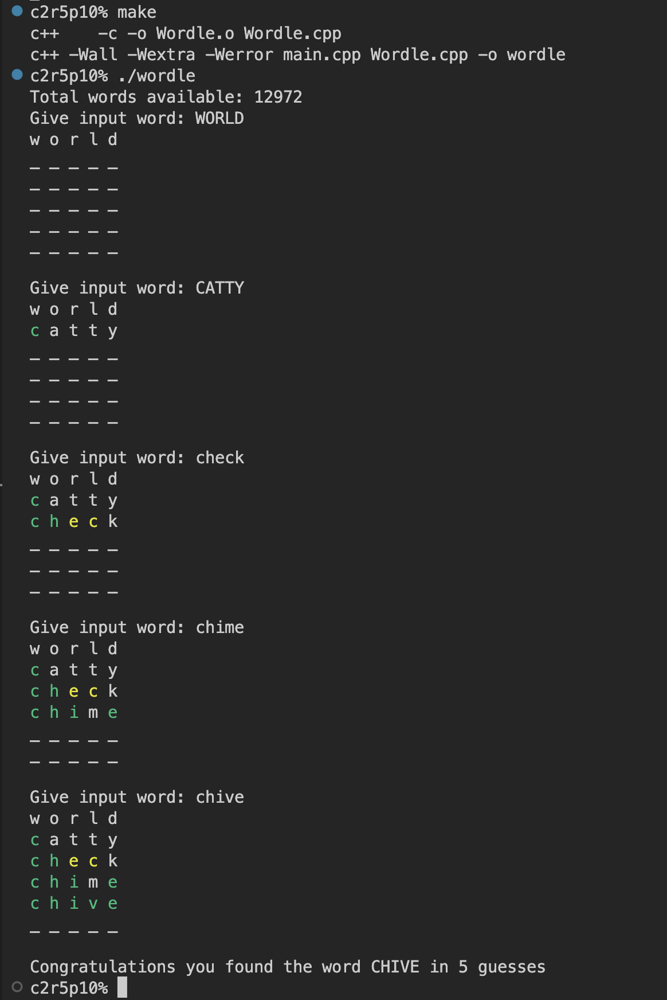

# 
Wordle - classic game in a shell

## Description

This C++ project, namely wordle, is an interactive word guessing game designed to run in a shell environment. The game revolves around the classic "Wordle" concept and challenges players to guess a five-letter word by providing feedback after each attempt. Players input their guesses via the command line, and the game responds with color-coded hints: green for correct letters in the right position, yellow for correct letters in the wrong position, and default text for incorrect letters. The game's rules are simple yet engaging, fostering strategic thinking and vocabulary skills. Enjoy playing!

 

## Language used

 

## Usage
**1- To compile the programme:**

    Make

**2- Run your program with arguments:**

	./wordle

## How to play

Wordle rules:

- Guess a five-letter word.
- Limited attempts to find the word.
- Receive feedback after each guess.
- Yellow: Correct letters in wrong position.
- Green: Correct letter and position.
- Deductive reasoning to guess the word.
- Goal: Solve the word using as few tries as possible.

## Example

## If you need help with playing wordle

+ [Wordle world helper](https://word.tips/wordle/)

## If you enjoy playing wordle online

+ [Play wordle online](https://wordlewordle.org/)
